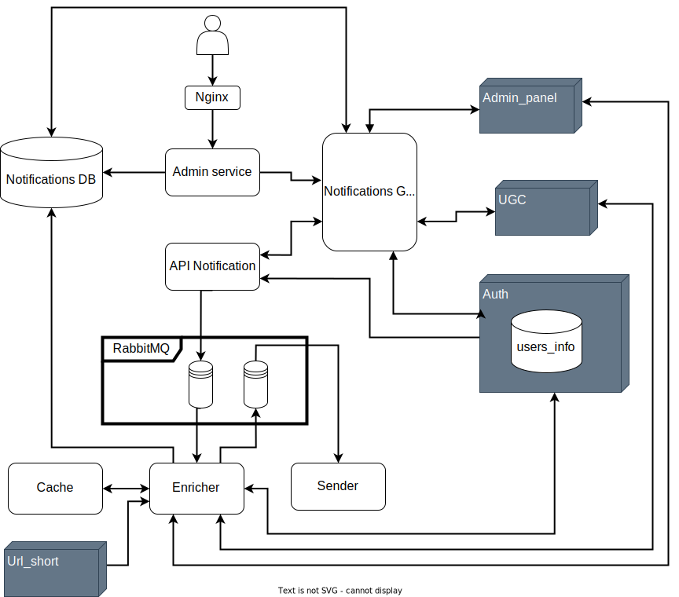

# Проектная работа 10 спринта

[Проект](https://github.com/GA10v/notifications_sprint_1)

Сервис уведомлений пользователя о новых событиях онлайн-кинотеатра

## Реализованные уведомления
1. Информация о лайках под ревью
2. Выход новой серии/фильма
3. Приветственное письмо
4. Рассылка от менеджера для группы пользователей

## Схема проекта

## Используемые технологии
- Прокси-сервер - Nginx
- Панель администратора - Django;
- Планировщик отправления уведомлений - Django-celery-beat;
- API сервиса уведомлений - Fastapi;
- API сервиса создания коротких ссылок - Flask;
- Брокер сообщений AMQP - RabbitMQ;
- База данных для хранения уведомлений - PostgreSQL;
- База данных для хранения кэша - Redis;
- Логирование - ELK;
- Все компоненты системы запускаются через Docker-compose;

## Запуск проекта
1. Установить зависимости командой
   `$ poetry install`
2. Создать файл конфигурации `.env` в корне проекта и заполнить его согласно `example.env`
3. Создать внешнюю сеть "notification-network" командой:
   `$ docker network create 'notification-network'`
4. Запустить контейнер командой
   `$ docker-compose up`
5. Перейти к документации Admin_panel по url: `http://localhost:8000/admin`(USER='asdmin', PASSWORD='admin')
6. Перейти к документации API по url: `http://localhost:8080/api/openapi`
7. Перейти к документации Mock_Auth по url: `http://localhost:8081/api/openapi`
8. Перейти к документации Mock_Admin_panel по url: `http://localhost:8082/api/openapi`
9. Перейти к документации Mock_ugc по url: `http://localhost:8083/api/openapi`
10. Перейти к документации RabbitMQ по url: `http://localhost:15672/` (USER='guest', PASSWORD='guest')

## Запуск ELK
1. Создать внешнюю сеть "notification-network" командой:
   `$ docker network create 'notification-network'`
2. Зпустить контейнер командой
   `$ cd ELK && docker-compose up`

## Авторы
- [GA10v](https://github.com/GA10v)
- [Student2506](https://github.com/Student2506)
- [gulyayko](https://github.com/gulyayko)
- [captainKoala](https://github.com/captainKoala)